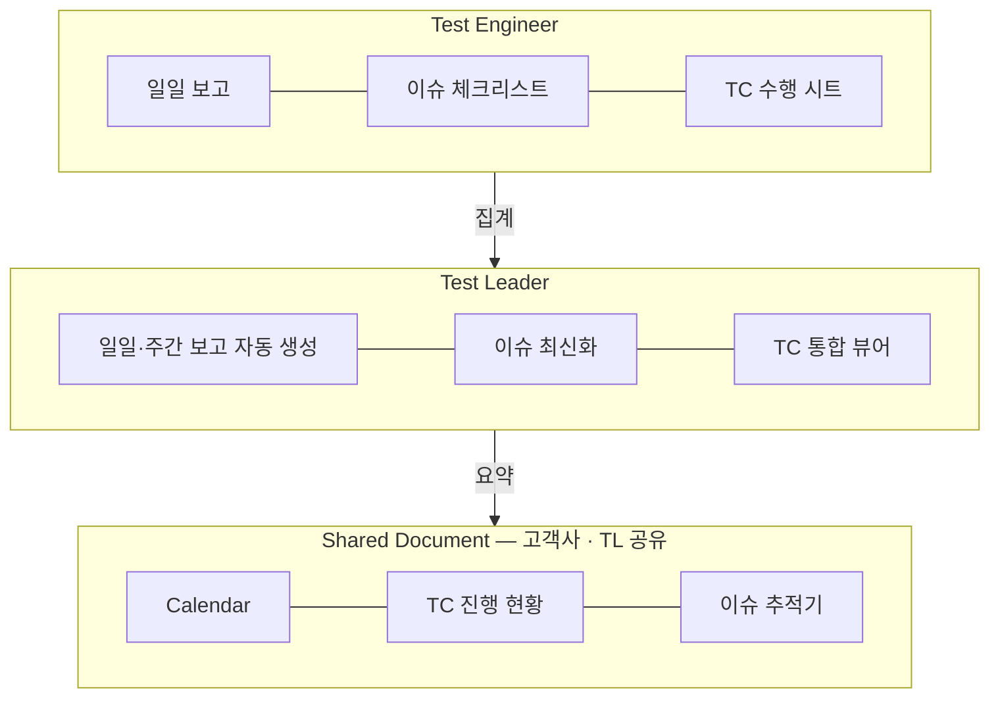

# qa-sheets-automation

> QA reporting automation for Google Sheets — a code-first rebuild of a formula-based system that shipped on 4 real outsourced QA projects.


파견 QA의 일일 보고·이슈 추적·TC 진행률 집계를 자동화하는 **Google Sheets + Apps Script** 시스템입니다. 큐로드 재직 중 수식 기반으로 설계해 실제 4개 프로젝트(VR FPS·Telegram 게임·Web3 거래소·MR 게임)에 배포했던 시스템을, 유지보수성과 테스트 가능성을 위해 **코드 기반으로 재설계**한 저장소입니다.

## 문제와 해결

| | Before (수작업) | After (이 시스템) |
|---|---|---|
| 일일 보고 | 테스터마다 매일 30~60분 취합 | 당일 날짜 필터로 자동 생성 |
| TC 진행률 | 문서별 수동 집계 | TC 문서들을 순회해 크로스 집계 |
| 이슈 현황 | 회의 전 수동 정리 | 심각도별/상태별/잔존 이슈 자동 요약 |
| 보고 발송 | 수동 전달 | 시간 트리거로 자동 실행 (메일/웹훅 옵션) |

## 아키텍처 — 권한 3계층

실무에서 검증된 구조: **보이는 것과 고칠 수 있는 것을 역할별로 분리**합니다.



상세: [docs/architecture.md](docs/architecture.md) · 수식→코드 전환 배경: [docs/migration.md](docs/migration.md)

## 모듈 구성

| 모듈 | 역할 | 원본 수식 대응 |
|---|---|---|
| `src/Config.js` | 설정 시트 파싱 (프로젝트명·TC 문서 목록·수신자) | 하드코딩 셀 참조 제거 |
| `src/TcProgress.js` | TC 문서 순회 → 진행률·성공률 크로스 집계 | `IMPORTRANGE + REGEXEXTRACT` 동적 참조 |
| `src/DailyReport.js` | 당일 결과 집계 → 보고서 시트 생성 | `FILTER + TODAY` 당일 필터 |
| `src/IssueTracker.js` | 심각도별/상태별/잔존 이슈 집계 | `COUNTIFS` 계열 |
| `src/Triggers.js` | 시간 트리거 일일 보고 자동 실행·발송 | (수식으로 불가능했던 영역) |
| `src/Menu.js` | 커스텀 메뉴 (`QA 자동화`) | — |
| `src/StyleGuide.js` | 색상 시스템 상수화 — 장시간 열람 문서의 눈 피로 기준 설계 | 원본 '색상 칼럼' 규약 |
| `lib/core.js` | **순수 집계 로직** (Sheets API 무의존) — Apps Script/Node 겸용 | 핵심 수식 전부 |

## 테스트

Apps Script는 로컬 실행이 불가능합니다. 그래서 계산 로직을 `lib/core.js`로 분리해 **Node 내장 테스트 러너로 검증**합니다 — 수식 기반 시스템에서는 불가능했던 일입니다.

```bash
npm test    # node --test, 22 tests
```

## 배포 (clasp)

```bash
npm i -g @google/clasp && clasp login
cp .clasp.json.example .clasp.json   # scriptId 입력
clasp push
```

시트 쪽 준비물(Config 시트 스키마, 권한 분리 설정)은 [docs/architecture.md](docs/architecture.md#설치)를 참고하세요.

## License

MIT © 2026 Daehun Oh
