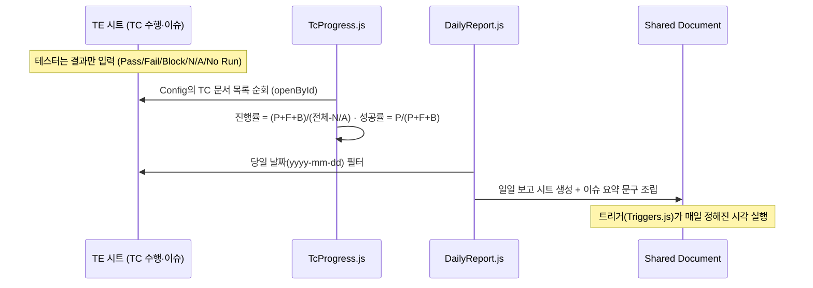

# 아키텍처 — 권한 3계층 QA 리포팅 시스템

> 원 설계는 큐로드 재직 중 4개 프로젝트(VR FPS · Telegram T2E · Web3 CEX · MR 게임)에 실배포되어 검증되었습니다. 이 문서는 그 구조와, 코드 기반 재구현에서의 대응 관계를 설명합니다.

## 1. 왜 3계층인가

파견 QA 환경에는 세 종류의 독자가 있습니다. 각자 **봐야 하는 것**과 **고쳐도 되는 것**이 다릅니다.

| 계층 | 독자 | 봐야 하는 것 | 고쳐도 되는 것 |
|---|---|---|---|
| Shared Document | 고객사 · TL | 캘린더, TC 진행 현황, 잔존 이슈 | 없음 (뷰 전용) |
| Test Leader | TL · Sub TL | 일일/주간 보고, 전체 TC 통합 뷰, 리소스 | 보고 양식, 일정 |
| Test Engineer | TE | 본인 TC 시트, 이슈 체크리스트 | 테스트 결과 입력 |

권한을 섞으면 사고가 납니다 — 고객사가 집계 수식을 건드리거나, TE가 보고 양식을 깨뜨리는 식입니다. 원본 시스템은 시트 색상 규약(연두=뷰어 / 주황=수정 가능 / 붉은색=수정 금지)과 문서 분리로 이를 강제했고, 코드 판은 `StyleGuide.js`에 그 규약을 상수화했습니다.

## 2. 데이터 흐름

## 3. 수식 → 코드 대응표

| 원본 수식 (실배포 버전) | 코드 판 | 개선점 |
|---|---|---|
| `IMPORTRANGE("...docs.google.com/.../" & REGEXEXTRACT(E5,"\((.*?)\)") & "/edit", "통계!K3")` | `Core.parseSheetIdFromName()` + `SpreadsheetApp.openById()` | 문서명 규약 파싱을 테스트 가능한 함수로 분리, 권한 오류를 명시적으로 처리 |
| `FILTER(Tracking!A:M, TEXT(Tracking!M:M,"yyyy-mm-dd")=TEXT(TODAY(),"yyyy-mm-dd"))` | `Core.filterRowsByDate()` | 타임존을 스크립트 속성으로 고정 — 수식의 암묵 타임존 문제 제거 |
| `IFERROR((F9+G9+H9)/(K9-I9), "0%")` | `Core.computeProgress()` | 0 나누기·빈 시트를 단위 테스트로 고정 |
| `COUNTIFS(Issuelist!E:E, "Highest", Issuelist!I:I, "<>이슈 종료")` | `Core.countBySeverityOpen()` | 심각도/상태 라벨을 상수로 관리 — 오타로 인한 0 집계 방지 |
| 수식으로 불가능 | `Triggers.js` (시간 트리거 + MailApp/웹훅) | 보고 "생성"을 넘어 "발송"까지 자동화 |

## 4. 설치

1. 대상 스프레드시트에 `Config` 시트 생성:

| A (key) | B (value) |
|---|---|
| PROJECT_NAME | 프로젝트명 |
| TIMEZONE | Asia/Seoul |
| REPORT_RECIPIENTS | (선택) 메일 수신자, 콤마 구분 |

2. `TC Documents` 시트에 TC 문서 목록 (이름 / 문서 ID 또는 `이름(문서ID)` 규약).
3. `clasp push` 후 시트 새로고침 → 메뉴 `QA 자동화` 확인.
4. `Triggers.js`의 `installDailyTrigger()`를 1회 실행해 일일 트리거 등록.

## 5. 한계와 다음 단계

- Sheets API 호출량 제한(쿼터) 안에서 동작하도록 문서 순회를 배치 처리했지만, TC 문서가 수십 개면 캐시 시트 도입이 필요합니다.
- 다음 단계: Slack 웹훅 포맷 개선, 주간 보고 자동화, (장기) Sheets를 프런트로 두고 집계를 BigQuery로 이관.
